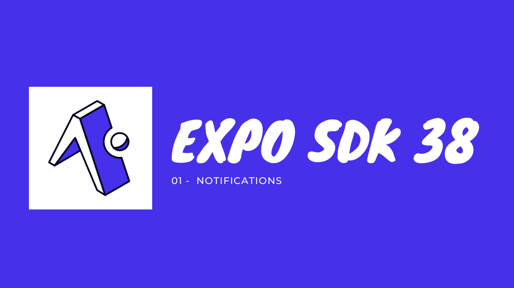
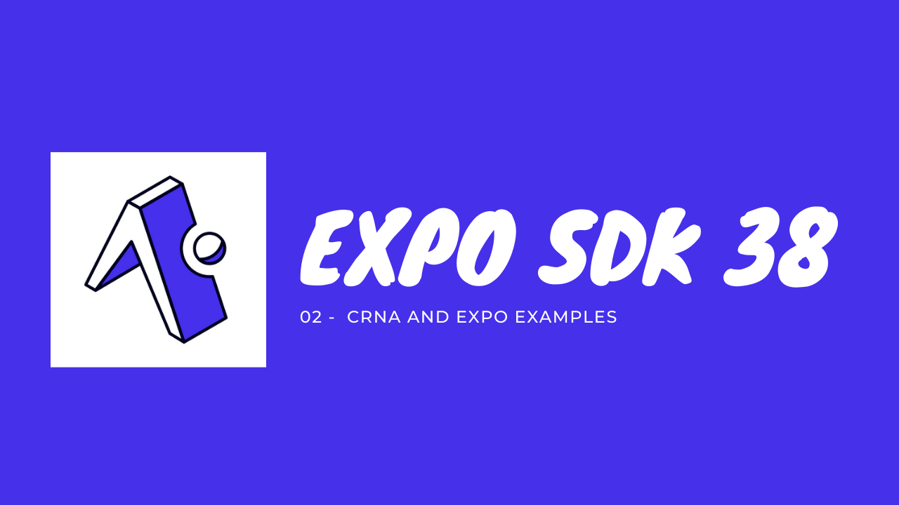

### Hi there, I'm [Mohamed aly!](https://mouhamedaly.dev) 👋

 

😍 I am passionnate about computer science, creating products, Design Thinking.  
💡 I love learning new technologies and sharing the most i can.  
💻 I am mostly developing apps with React native and Expo :)
❤️ I am a big expo Fan

 

#### 🤓 Check out my latest videos

<!-- YT LIST START -->

**[Les nouveautés du Expo SDK 38. Partie 1: Les notifications](https://www.youtube.com/watch?v=Kn14Xu3l-6w&t)**
  _Expo a sorti cette semaine la version 38 de son SDK. Dans cette vidéo on voit ensemble La nouvelle Api des notifications_

**[Les nouveautés du Expo SDK 38. Partie 2: CRNA and Expo Examples](https://www.youtube.com/watch?v=01qrhGKyxkg&t)**
  *Expo a sorti cette semaine la version 38 de son SDK. Dans cette video on voit ensemble le Create-react-native-app et les expo templates.*

